# CS 180 Project 1 - Ramya Chitturi

## Project Overview

Sergei Mikhailovich Prokudin-Gorskii was a Russian photographer. He traveled across the vast Russian Empire and took color photographs of everything he saw. Since there was no way to print color photos at the time, he recorded three exposures of every scene onto a glass plate using a red, a green, and a blue filter. Years later, his RGB glass plate negatives were found, and the Library of Congress was able to digitize these photographs and release them to the public.

## Approach

First, I isolated the blue, green, and red plates (in that order) by dividing the image into thirds lengthwise. I removed 10% of the border from each side, using only the middle 80% of the image to minimize any errors from the borders. For each of the basic/smaller images, I tested displacements in the range of [-15, 15) in both the x and y directions. I will talk about the metrics used later, but I would keep track of the best score seen so far. If a displacement would result in a better score, I would update the best score and displacement accordingly.

For the bigger images, going through all of the possible displacements is too slow and consuming. Thus, I implemented an image pyramid, as per the directions. My pyramid had 5 levels. First, I shrunk down the image by 2^5 (rescaling the image to be half its size for each pyramid level). Once I had the smallest image, I checking for the starting displacement using 5% the image size. After, I doubled the size of the image and also the displacement. From there, I checked for an updated displacement in the [-5, 5) range and added the new displacement to the previous value. 

### Alignment Metrics
I tried 3 main alignment metrics, with the fourth being part of the bells and whistles. 

1. Sum of squared differences/Euclidean distance (SSD): As suggested, I tried using SSD first. 
2. Sum-absolute error (SAE): This worked better for some of the larger images than SSD, especially emir.tif.
3. Normalized cross correlation (NCC): Using NCC helped improve the results of some of my larger images with the pyramid. To implement, I first normalized the values of the red or green images before computing the dot product sum with the blue image. I also negated the final metric so that I could continue to find the minimum score for the optimal displacement.
4. SSIM (see below)

The final results of all of the given images are provided at the end.

## Bells and Whistles

### Structural Similarity
I used the structural similarity index (SSIM) at the end, mainly to align the emir image. NCC worked much more quickly than SSIM and produced fairly similar results for the rest of the images. I used the `structural_similarity` function from `skimage`'s `metrics` package. I also negated this result so that I could continue to minimize the score. SSIM works better for emir than the other 3 metrics because it operates in the L\*a\*b\* color space rather than RGB, and emir has very little information in the red and green image channels. Below is the result of emir.tif with the four metrics I tried:

| Emir with SAE | Emir with SSD | Emir with NCC | Emir with SSIM |
| :---: |  :----: | :---: | :---: |
|  |  |  | 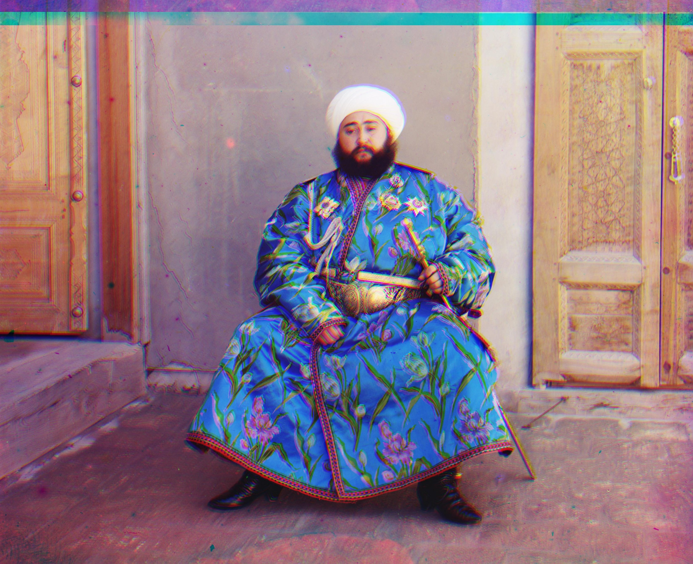 |
| G: (26, 40)   R: (37, 88) | G: (20, 37)   R: (-263, 101) | G: (20, 37)   R: (-263, 101) | G: (13, 57)   R: (25, 121) |

### Automatic Contrasting
I first rescaled the pixel values to be in the 0 to 1 range. Then I applied the main function I used, which was `equalize_adapthist` from `skimage`'s `exposure` package. Then, I rescaled the image back to values from 0 to 255 and converted it to the `uint8` type. Below is a selection of images before and after applying the automatic contrasting:

| Name | Without Contrast | With Contrast |
| :---: | :----: | :----: |
| Church | 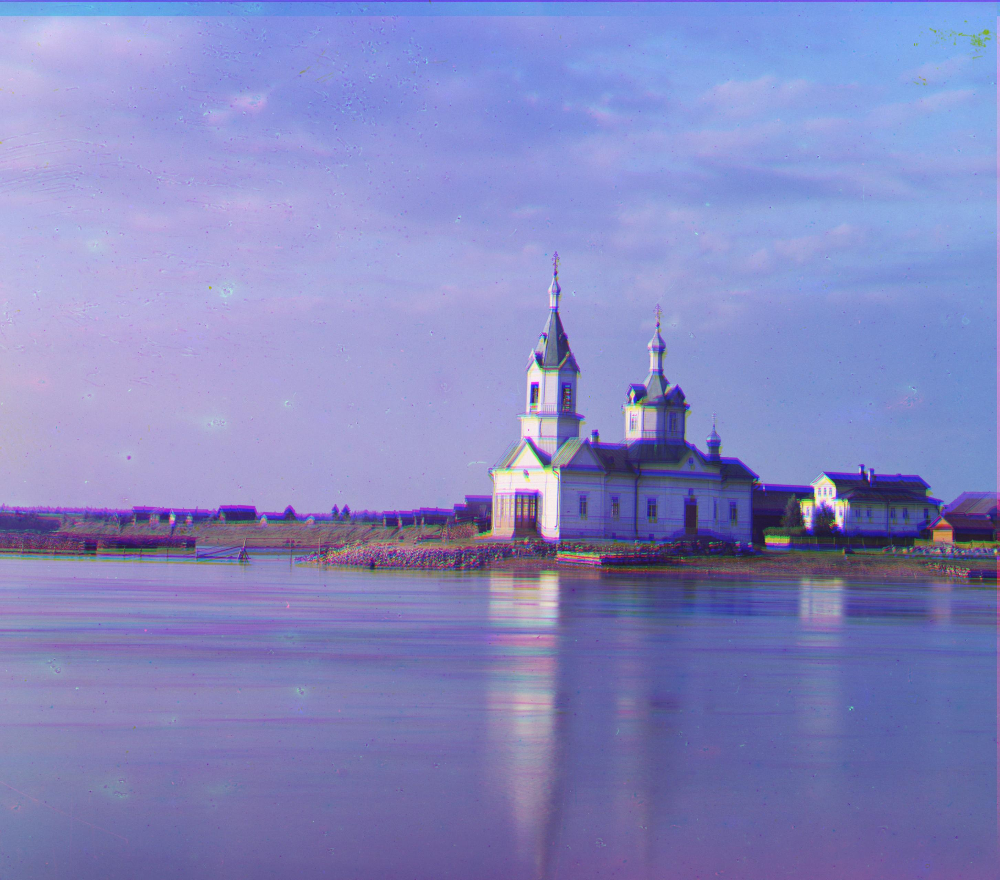 | 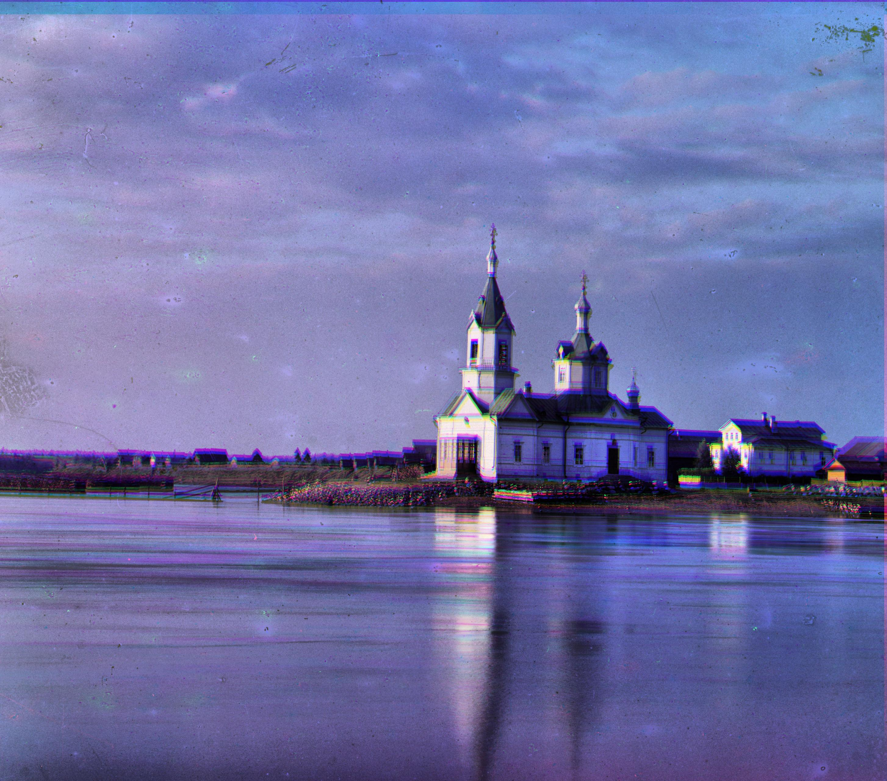 |
| Three Generations | 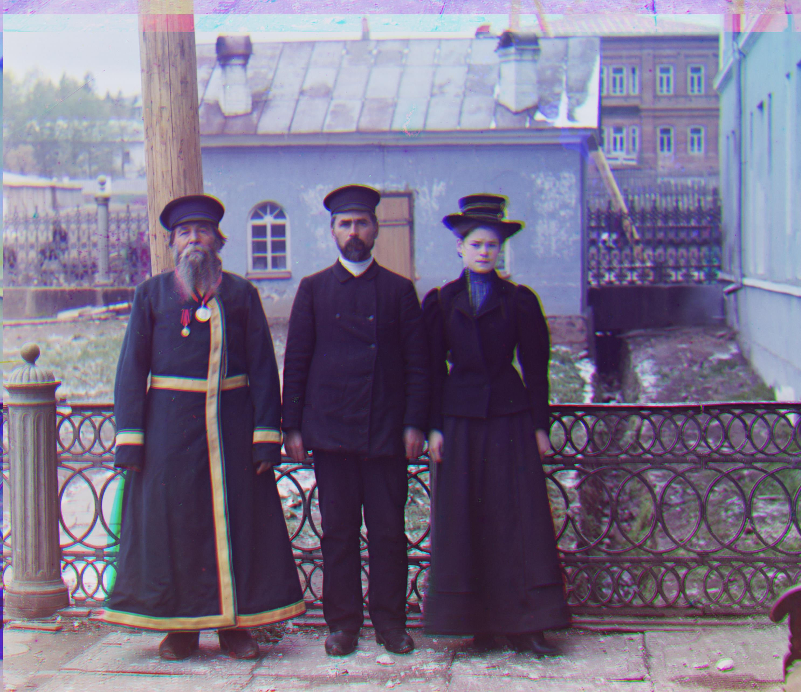 | 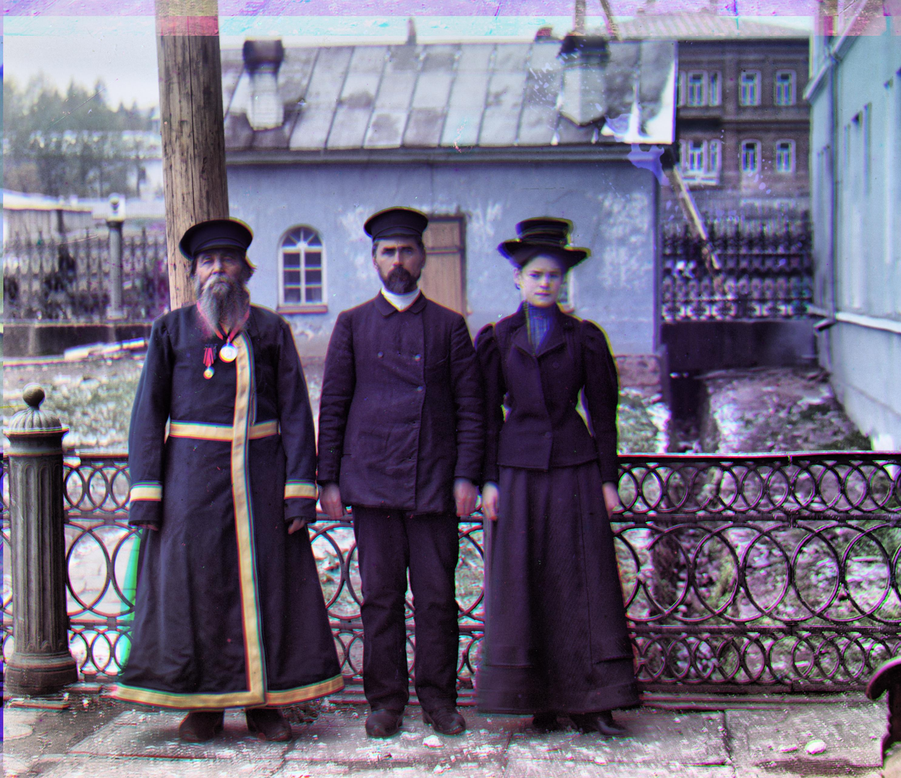 |

## Final Results

The following images were generated using the NCC metric.

| Name | Image and Offset | Name | Image and Offset |
| :---: |  :----: | :---: | :---: |
| Cathedral | 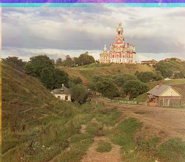   G: (2, 5)   R: (3, 12) | Church |    G: (26, 40)   R: (37, 88) |
| Emir |    G: (20, 37)   R: (-263, 101) | Harvesters | 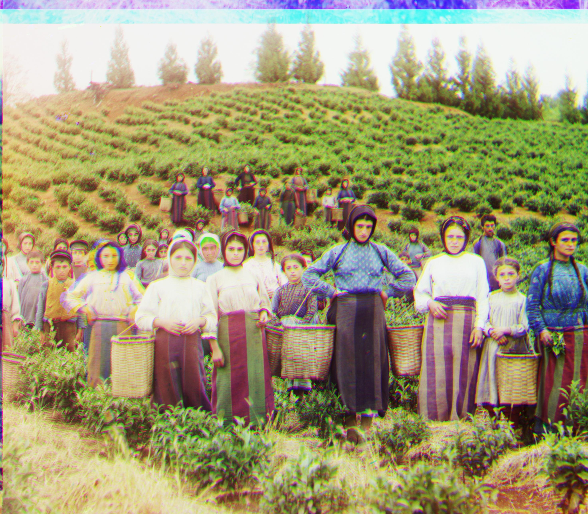   G: (14, 47)   R: (8, 118) |
| Icon | 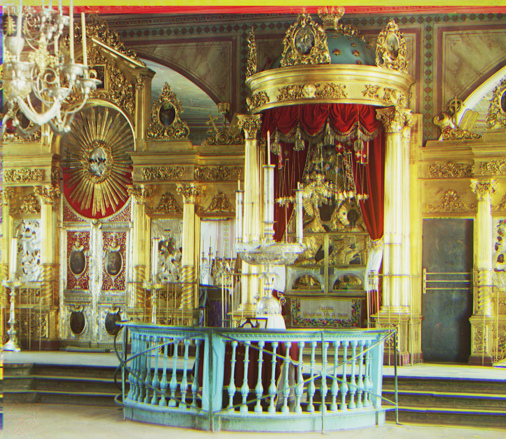   G: (15, 34)   R: (21, 79) | Lady |    G: (8, 33)   R: (6, 96) |
| Melons | 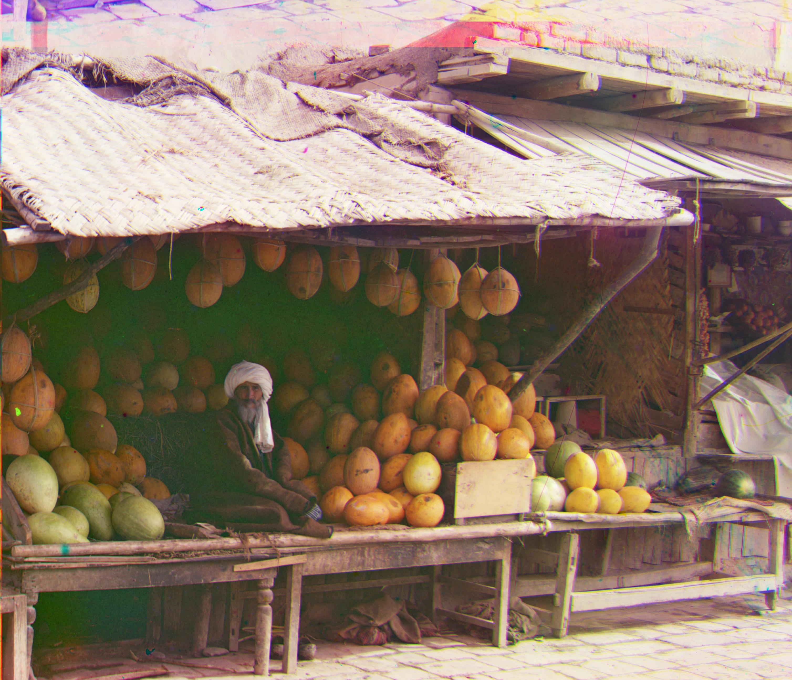   G: (2, 82)   R: (8, 179) | Monastery | 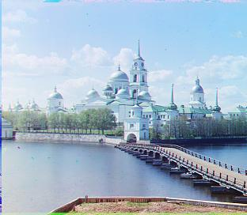   G: (2, -3)   R: (2, 3) |
| Onion Church |    G: (26, 40)   R: (33, 97) | Sculpture | 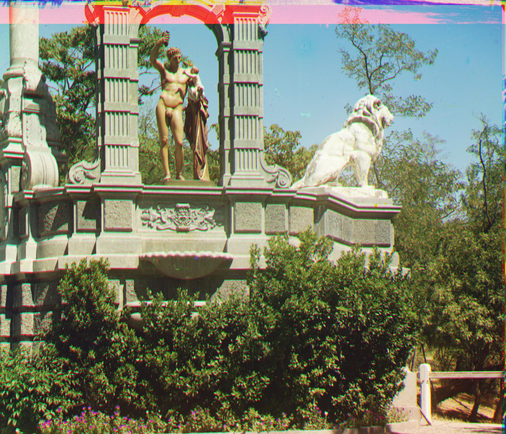   G: (-8, 30)   R: (-24, 142) |
| Self-Portrait | 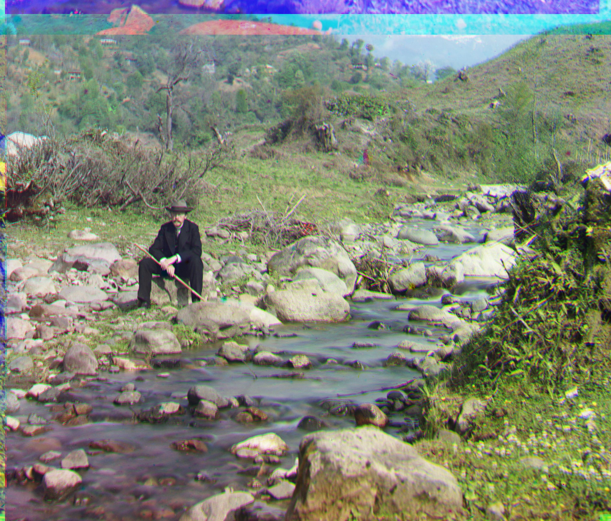   G: (25, 70)   R: (34, 173) | Three Generations |    G: (11, 53)   R: (10, 118) |
| Tobolsk | 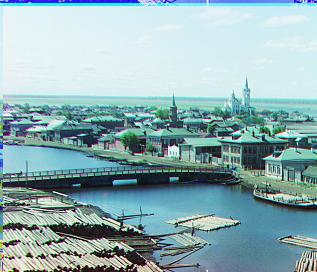   G: (3, 3)   R: (3, 6) | Train | 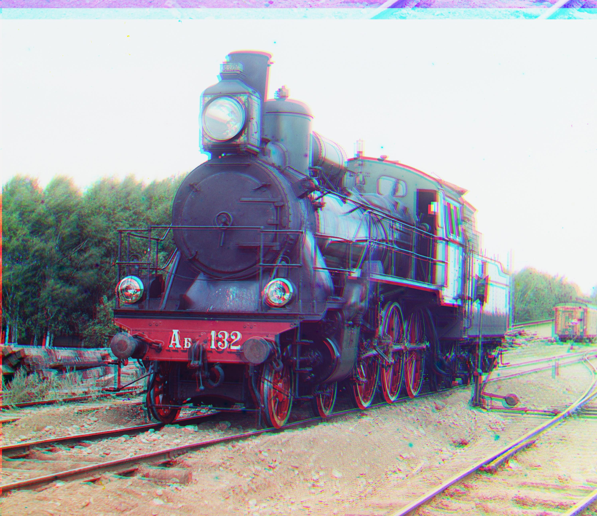   G: (0, 41)   R: (10, 97) |
