# Fun with Filters and Frequencies

## Part 1 - Fun with Filters

### Part 1.1: Finite Difference Operator
I used the following finite difference operators: 
`dx = np.array([[1, -1]])` and `dy = np.array([[1], [-1]])`. I convolved these with the cameraman input image by using `scipy.signal.convolve2d` with `mode='same'`. I combined the partial derivatives by squaring each, adding them together, and then taking the square root. The threshold for my binary image was 35.

| | dx | dy |
| :----: | :----: | :----: |
| Derivative | 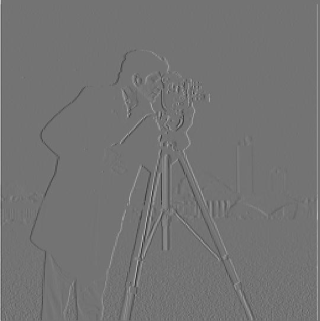 | 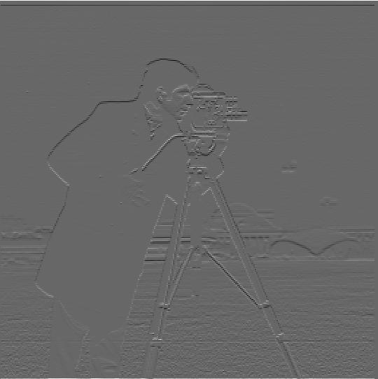 |
| Binarized | 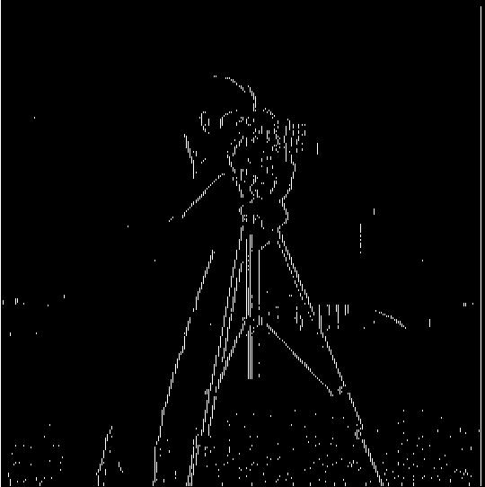 | 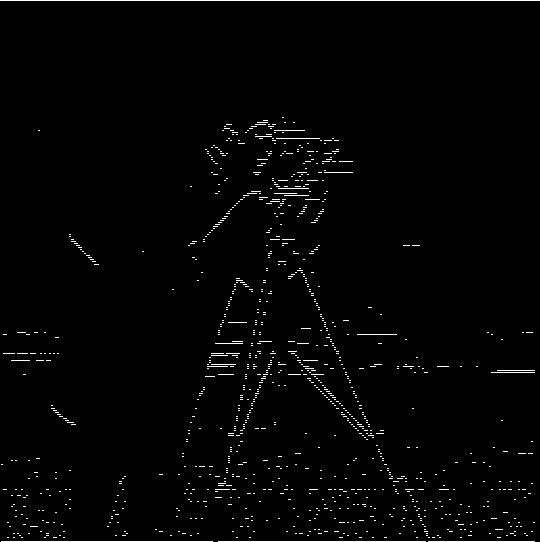 |

| Combined Gradient | Combined Binarized |
| :----: | :----: |
| 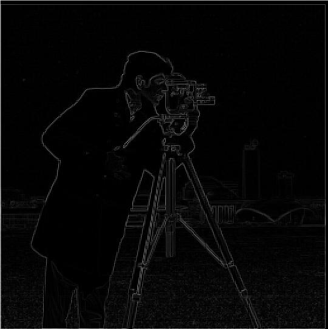 | 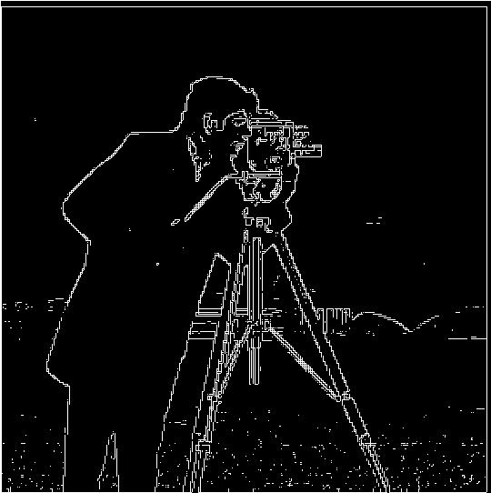 |

### Part 1.2: Derivative of Gaussian (DoG) Filter
I used the Gaussian kernels to blur the images before using the finite difference operator to generate the partial derivatives. Here, `kernel_size = 10` and `sigma = kernel_size / 6` Then, we combine them into a single edge image using the same idea from 1.1. 

| | dx | dy |
| :----: | :----: | :----: |
| Derivative | 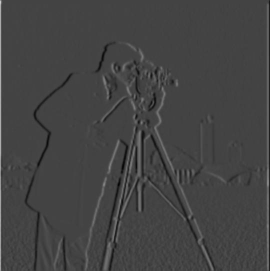 | 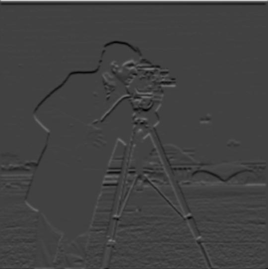 |
| Binarized | 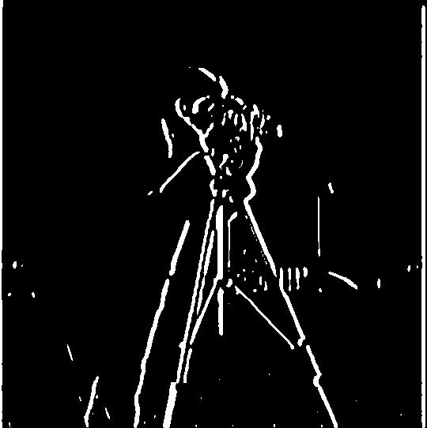 | 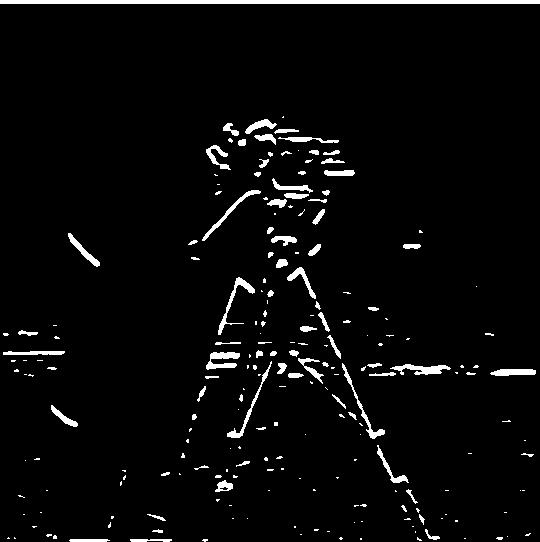 |

| Combined Gradient | Combined Binarized |
| :----: | :----: |
| 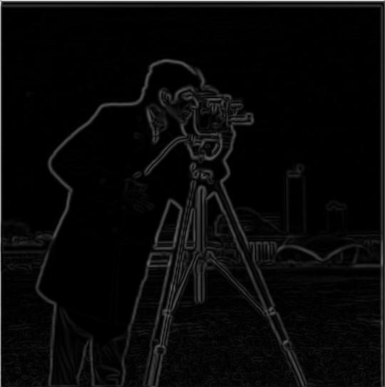 | 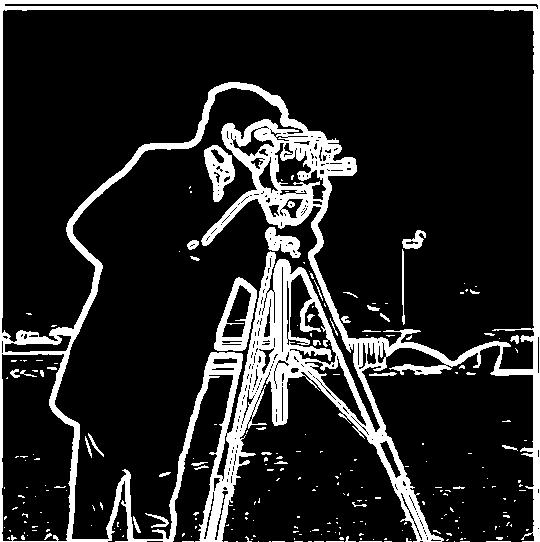 |

#### Comparing Finite Difference and DoG
The results are similar except for small variations in length and shape of smaller edges due to noise. The main difference is that the edges of the DoG filter are thicker and also a bit smoother. Since the Gaussian filter is a low-pass filter, this makes sense since less high frequency components mean less noise and better edge detection.

| Binarized Finite Difference | Binarized Derivative of Gaussian |
| :----: | :----: |
|  |  |

## Part 2 - Fun with Frequencies

### Part 2.1: Image "Sharpening"
To sharpen an image, we convolve the input image with a gaussian kernel. This acts as a low-pass filter, allowing us to get rid of the higher frequencies. To get the high-frequency details, we use the following operation: `details = target_im - blurred_im`. This removes the lower frequencies from the original image. We then choose some alpha in order to create the final sharpened image using `sharpened_result = target + alpha*details`. In the following results, `alpha = 1`.

| Original Image | Sharpened Image | Details |
| :----: | :----: | :----: |
|  | 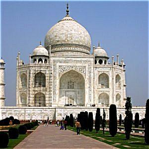 | 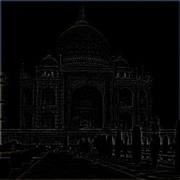 |
|  | 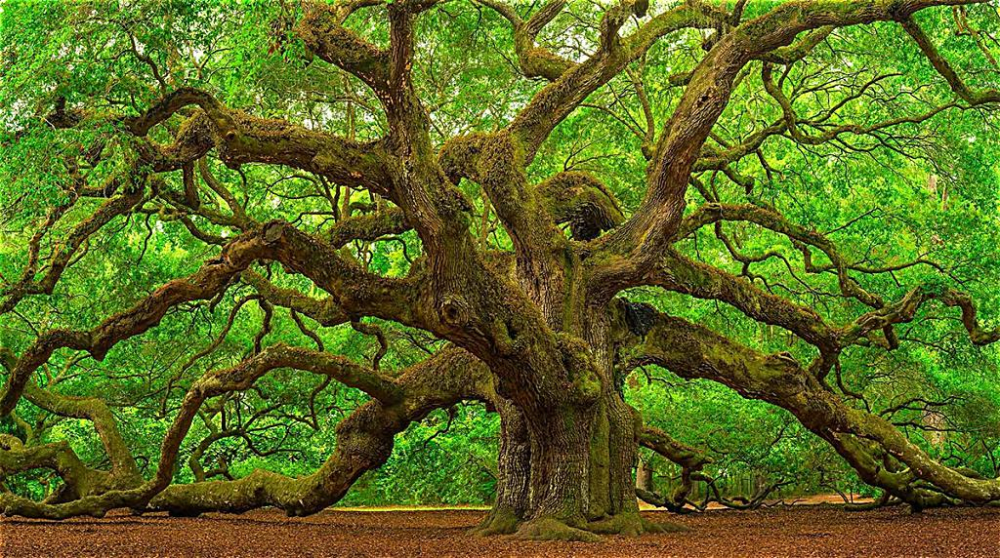 | |

Next, we blur the image of this orange cat using `kernel_size = 10` and `sigma = kernel_size / 6`. We sharpen the image normally with `alpha = 1`, and then we sharpen the image after blurring with `alpha = 2`.

| Original Image | Sharpened Image | Blurred Image | Blurred then Sharpened |
| :----: | :----: | :----: | :----: |
|  | 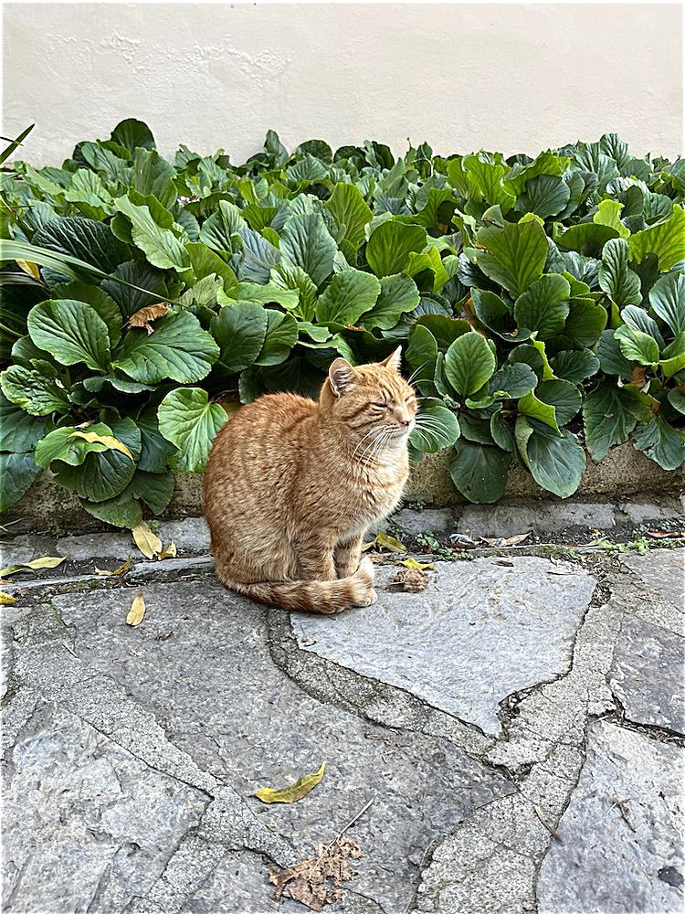 | 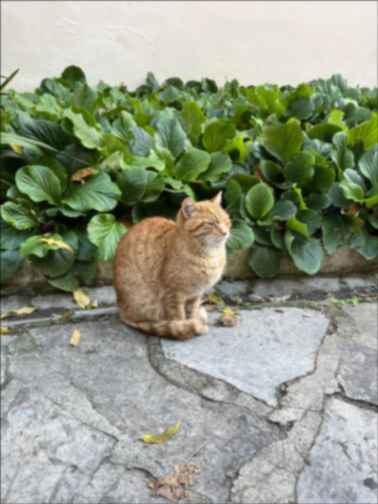 |  |

### Part 2.2: Hybrid Images
We take in two input images, `im_high` and `im_low`, and align them using the provided function. We use a gaussian blur on the high frequency image using `kernel_size = 6 * sigma_high` to generate `blurred_im_high`. Then, we get the high frequency image using `high = im_high - blurred_im_high`. After that, we blur the low frequency image using `kernel_size = 6 * sigma_low` to get `blurred_im_low`. We average the pixels of `high` and `blurred_im_low` to get our hybrid image!

| Low Frequency Image | High Frequency Image | Hybrid Image |
| :----: | :----: | :----: |
|    Derek |    Nutmeg | 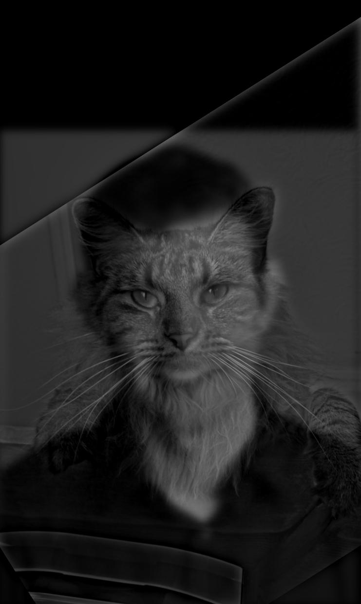   sigma_low = 8   sigma_high = 11 |
|    Basketball |    Orange Cat | 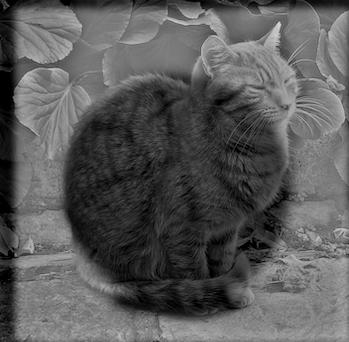   sigma_low = 4   sigma_high = 10 |
| 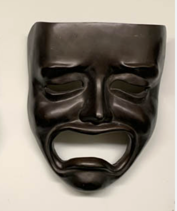   Tragedy | 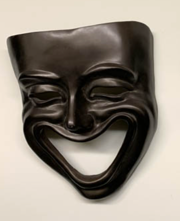   Comedy | 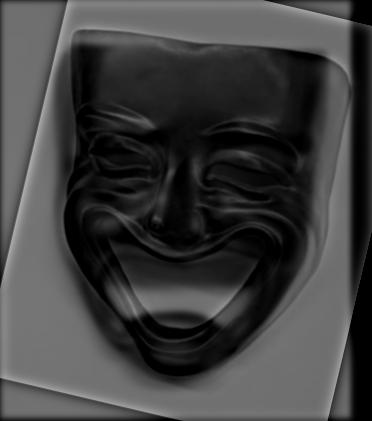   sigma_low = 3   sigma_high = 6 |

The following hybrid image failed, likely because of the paper plane's thick black lines compared to the airplane.

| Low Frequency Image | High Frequency Image | Hybrid Image |
| :----: | :----: | :----: |
| 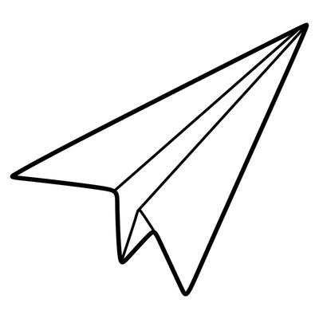   Paper Plane |    Airplane | 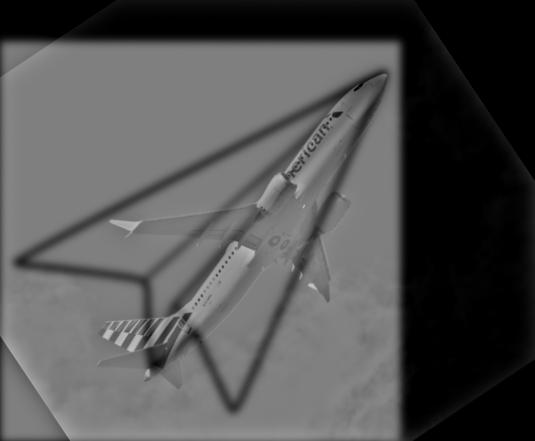   sigma_low = 4   sigma_high = 10 |

#### Fourier Analysis
I liked the way that comedy and tragedy turned out, so I performed Fourier analysis below.

|  |  |
| :----: | :----: |
| 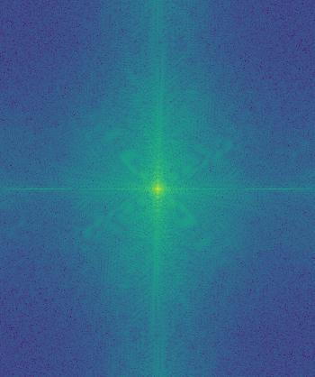   Paper Plane FFT | 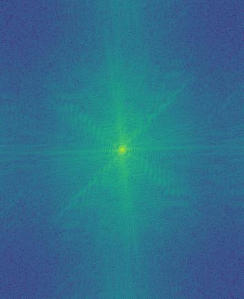   Airplane FFT |
| 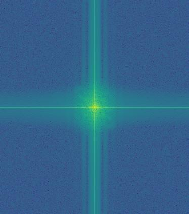   Low Frequency FFT | 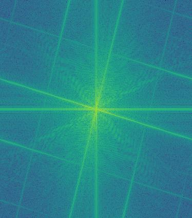   High Frequency FFT |

| |
| :----: |
| 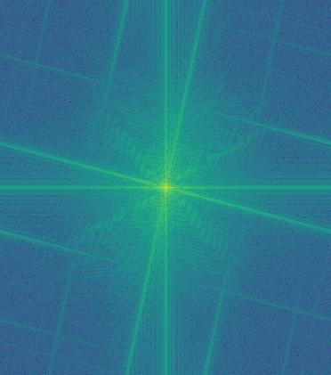   Hybrid Image FFT |

#### Part 2.2 - Adding Color (Bells and Whistles)
I experimented with using color on Derek and Nutmeg.

| No Color | Low Frequency Color | High Frequency Color | Both Frequency Color |
| :----: | :----: | :----: | :----: |
|  | 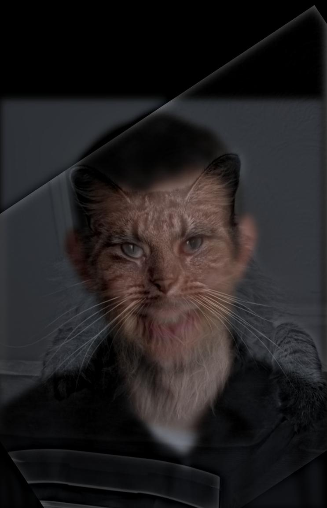 | 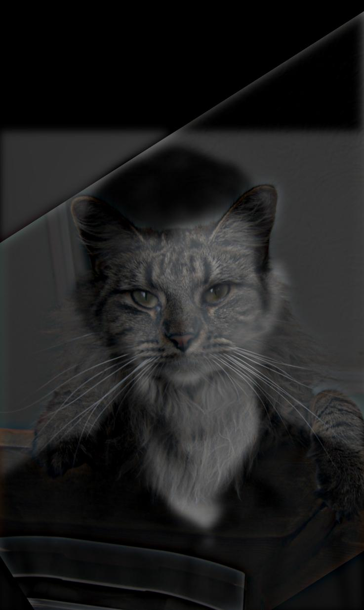 | 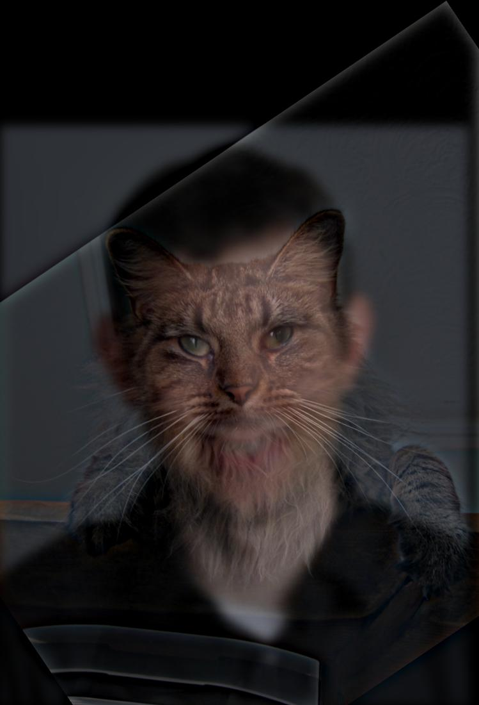 |

The color really only helps the low frequency image, considering that just using color on Nutmeg (high frequency) makes no difference. Using color on the low frequency image or both images makes it look different but not necessarily a lot better.

### Part 2.3: Gaussian and Laplacian Stacks

We create Gaussian and Laplacian stacks for the input images. At every level of the Gaussian stack, we blur the previous image level with a kernel to get the current level’s image. We are using a Gaussian stack, which means that the image size remains the same. We can generate the Laplacian stack by using the Gaussian stack. At level `i`, `l_stack[i] = g_stack[i] - g_stack[i+1]`. At the last level `i`, `l_stack[i] = g_stack[i]`. This allows both stacks to have the same length. Each stack has 5 layers/levels.

Here are levels 0 through 4 of the input images' Gaussian and Laplacian stacks. The Laplacian stack images here are normalized over the entire image (for visual purposes), but the un-normalized versions are using during computation.

| |
| :----: |
|    Apple Gaussian Stack|
| 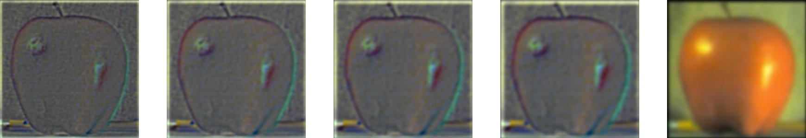   Apple Laplacian Stack|
| 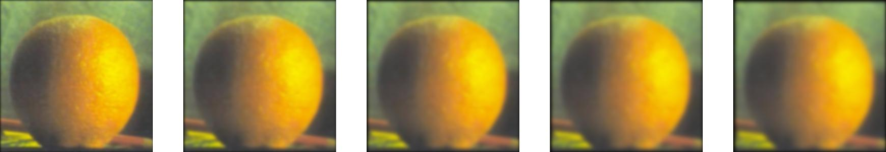   Orange Gaussian Stack|
| 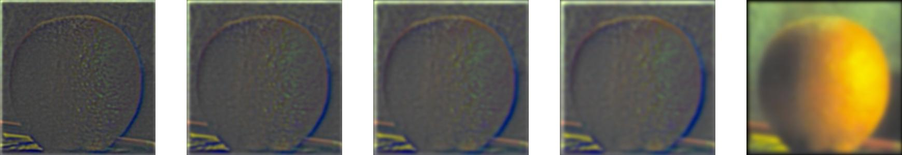   Orange Laplacian Stack|

### Part 2.4: Multiresolution Blending

After I had the Gaussian and Laplacian stacks for the 2 input images as well as the Gaussian stack for the mask, I could blend everything together. I created the blended image by doing: `blended_stack = g_stack_mask * l1_stack + (1 - g_stack_mask) * l2_stack`.
In addition to the oraple, I blended two other images (where the baby + bread blended image has an irregular mask). I used `kernel_size = 12` and `N = 5`, with the exception of the Gaussian stack of the mask which had `kernel_size = 60`.

| Image 1 | Image 2 | Mask | Blended Image |
| :----: | :----: |  :----: | :----: |
|  |  |  | 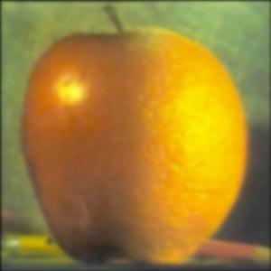 |
| 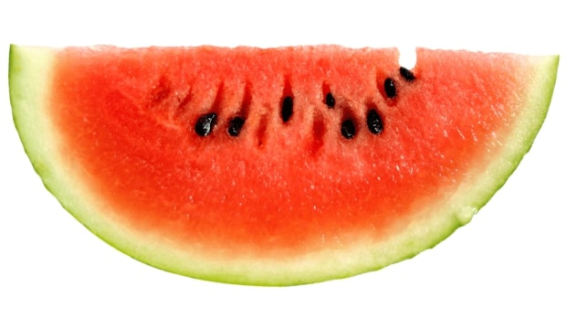 | 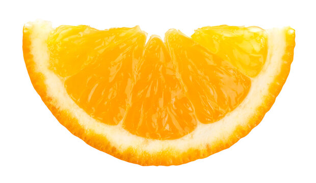 |  |  |
| 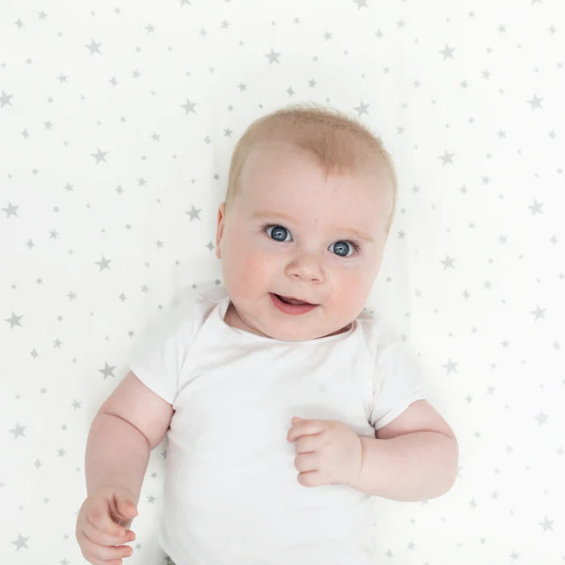 | 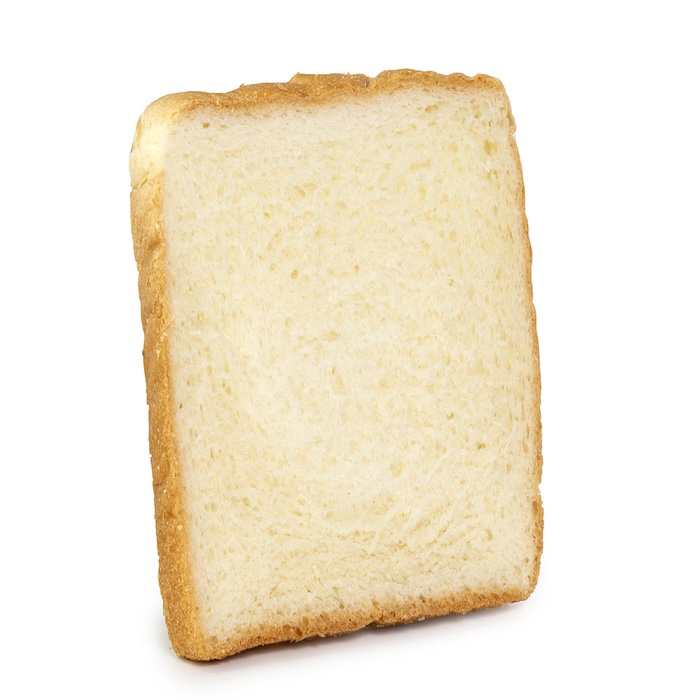 | 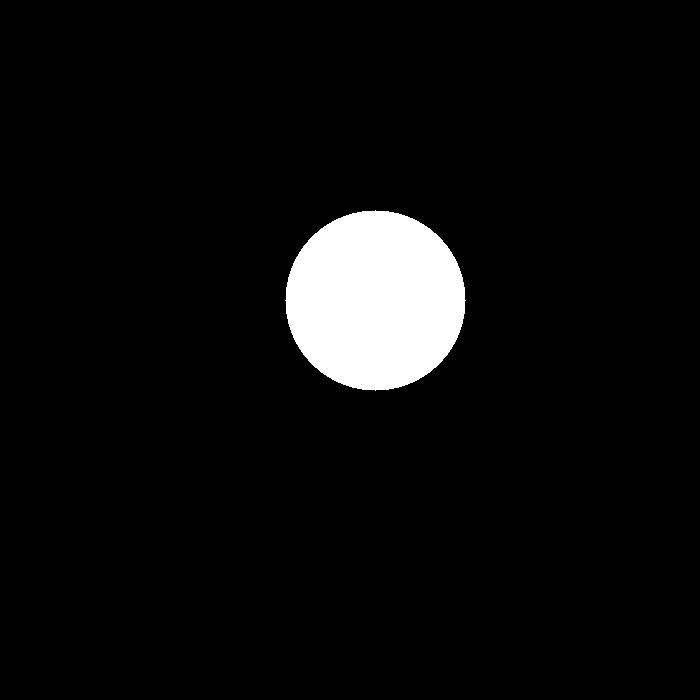 Irregular Mask Example | 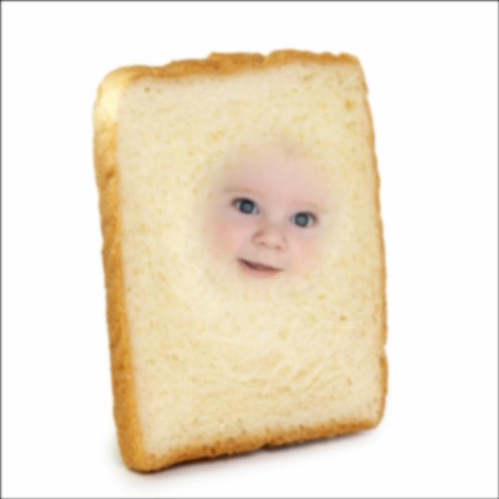 |

#### Figure 3.42 Recreated

I created Figure 3.42 from the textbook on the oraple.

| |
| :----: |
| 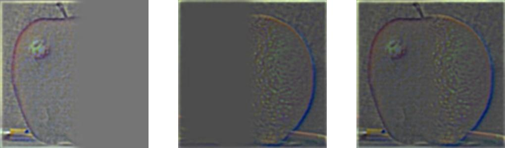   Level 0 |
| 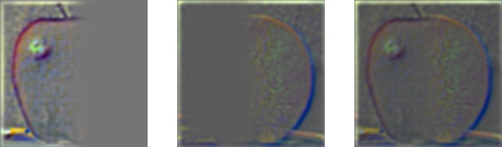   Level 2 |
| 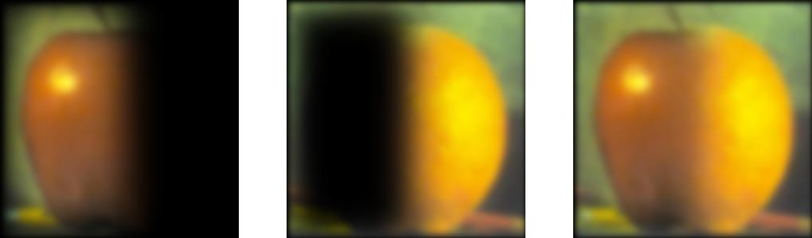   Level 4 |
| 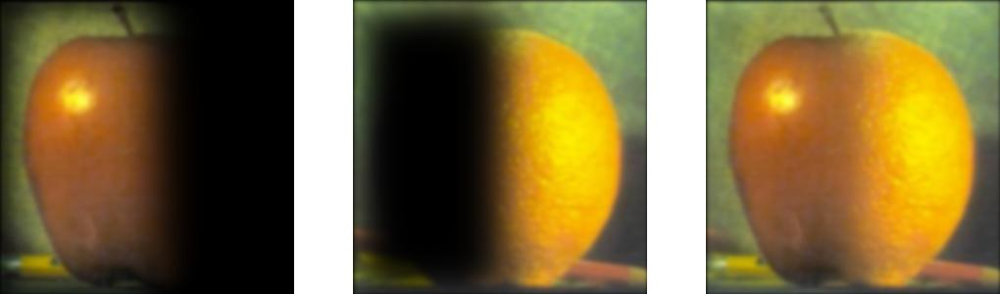   Collapsed |

Here is the final result again:

| Image 1 | Image 2 | Blended Image |
| :----: | :----: | :----: |
|  |  |  |