# Face Morphing

## Part 1. Defining Correspondences

I used this [correspondence tool](https://cal-cs180.github.io/fa23/hw/proj3/tool.html) from a previous semester's student to find corresponding points between my two faces. I loaded in the points from the resulting JSON file and used `scipy.spatial.Delaunay` to produce `tri` for both images. Then I used `plt.triplot` on `tri.simplices` to view the resulting triangles.

| Input Images | Correspondences | Triangulation |
| :----: | :----: | :----: |
| 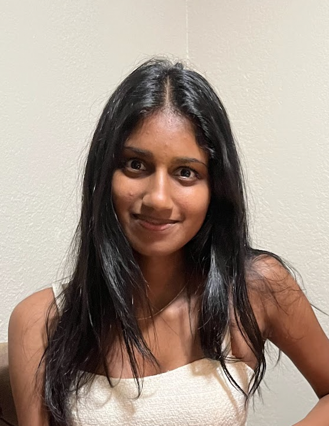 | 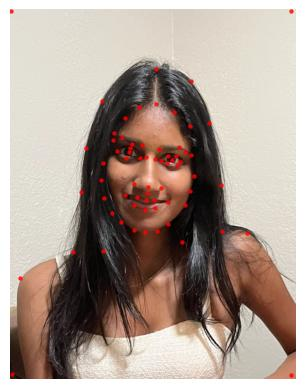 | 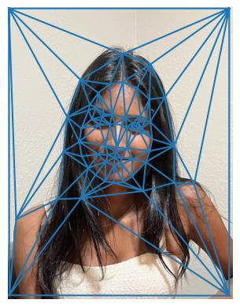 |
| 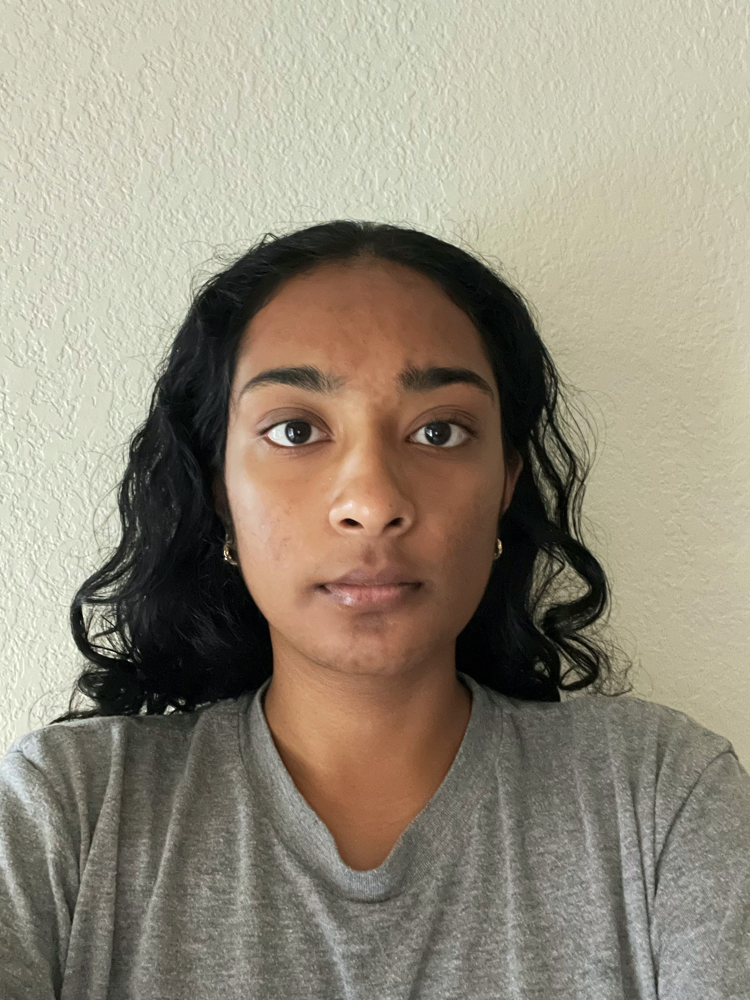 | 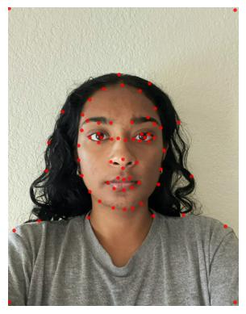 | 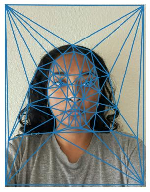 |

## Part 2. Computing the "Mid-way Face"

To create the midway image, I needed both images and their correspondence points, along with the warp amount and dissolve amount. The warp and dissolve amounts are both 0.5 for this part of the project. I computed the midway points by doing `(1.0 - warp_amt) * im1_points + warp_amt * im2_points`. Then, I computed the Delunay triangles. For each of the `N` corresponding triangles for both images, I computed the affine transformation for each and solved for the 6 unknowns. 

Then, I used `skimage.draw.polygon` to find all the points that were within the triangle. I multiplied these coordinates by the inverse affine matrix. I also clipped the resulting x and y values to ensure that they remained within the image. I didn't select many correpondence points below shoulder level, so this explains why the midway face there is more overlapped. 

| Input Image 1 (Kavya) | Input Image 2 (Ramya) | Midway Face |
| :----: | :----: | :----: |
|  |  | 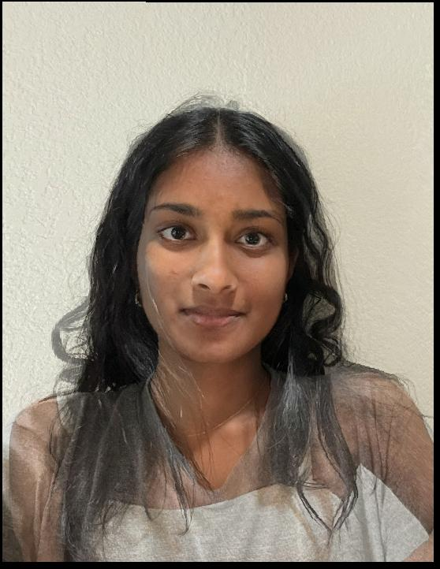 |

## Part 3. The Morph Sequence

I used 100 frames in my morph sequence. The warp amount and dissolve amount is determined by `i / 100`, where `i` is the current frame number. 

## Part 4. The "Mean face" of a population

I used the FEI Face Database as my dataset. I downloaded the points from `frontalshapes_manuallyannotated_46points` and the datasets from `frontalimages_spatiallynormalized`. I combined both folders (parts 1 and 2) into one final folder. To generate the average correspondence points of the population, I averaged the coordinate values. The images marked with an `a` had a neutral expression, while the images marked with a `b` had a happy/smiling expression. Thus, I generated two mean images so we could have separate ones per expression. For the mean population image, I used the points from each image and the average image to create the warped image. I used a warp amount of 0.5 and a dissolve amount of 0.

Here are some images (both neutral and happy) from the dataset that were warped to fit the average face shape.

| Original Neutral Image | Warped Neutral Image | Original Happy Image | Warped Happy Image |
| :----: | :----: | :----: |  :----: |
|  | 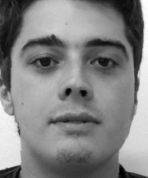 |  |  |
|  | 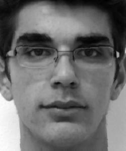 |  |  |
|  | 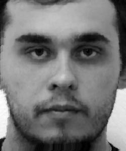 |  | 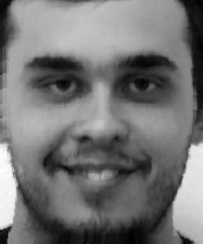 |

Here are the images of the mean faces, as well as me warped into the mean face shape and vice versa.

| Mean Face Neutral | Mean Face Happy |
| :----: | :----: |
| 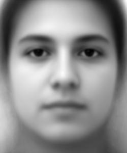 | 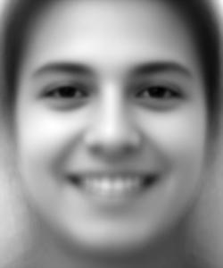 |

| Mean Face Neutral -> Ramya | Ramya -> Mean Face Neutral |
| :----: | :----: |
| 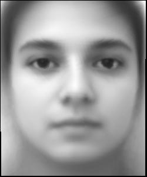 | 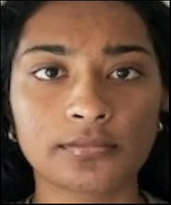 |

## Part 5. Caricatures: Extrapolating from the mean

To generate the caricature, I changed the warp amount to no longer be in between 0 and 1. The warp amount is factored into the midpoints as such: `(1.0 - warp_amt) * im1_points + warp_amt * im2_points`. I warped my face based on the neutral mean image. I got the following results with larger warp values:

| Warp Amount = 1.5 | Warp Amount = 2 |
| :----: | :----: |
|  | 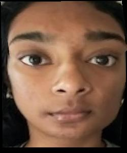 |

Two noticeable differences are that my eyes are larger/further apart, and my chin is smaller.

## Bells and Whistles

### Changing Gender

I chose an image of an average Indian man that I found online to try and change my gender.

| Me | Average Indian Man |
| :----: | :----: |
| 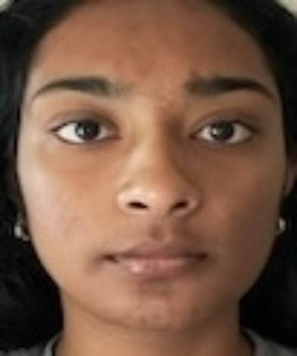  |  |

| Change Appearance |  Change Shape | Change Shape + Appearance |
| :----: | :----: | :----: |
| 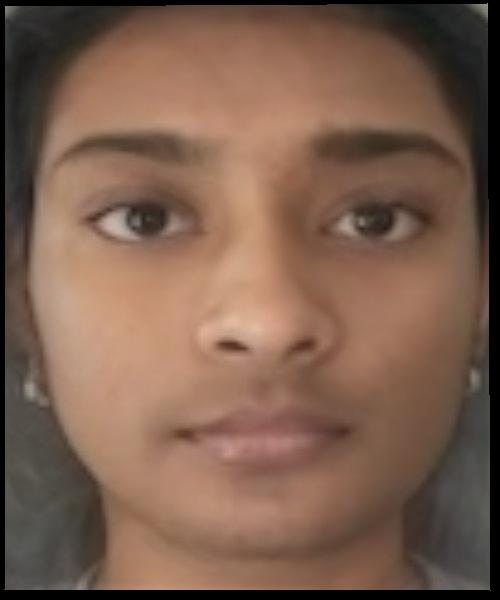 | 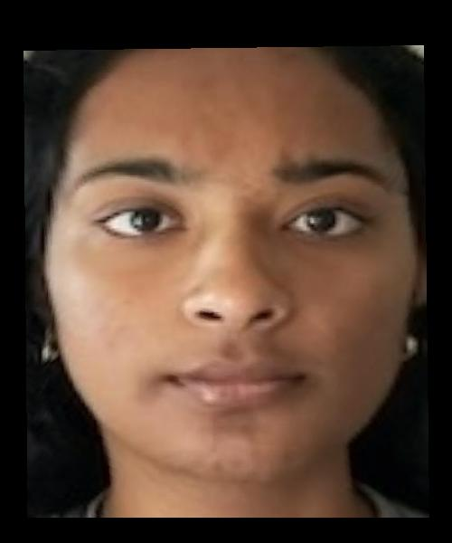 | 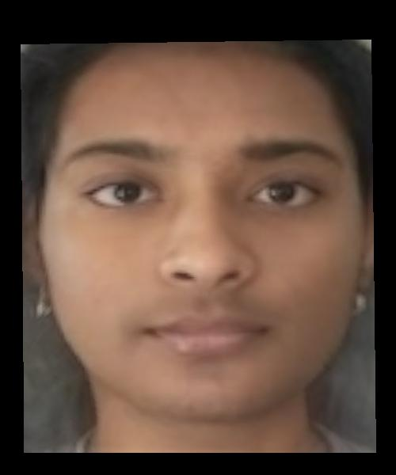 |