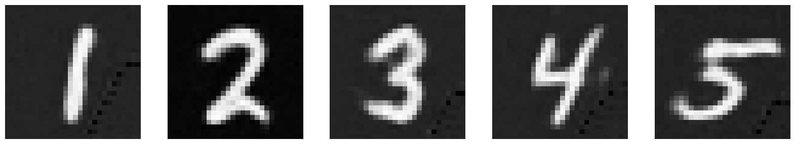

# Project 5: Fun with Diffusion Models

## Part A: The Power of Diffusion Models!

### Part 0: Setup

I use a random seed of 1880 throughout the project. I use the three following captions to generate the images:
- `'an oil painting of a snowy mountain village'`
- `'a man wearing a hat'`
- `'a rocket ship'`

Here are the outputs of the 3 prompts when `num_inference_steps=5`.

| Mountain | Man | Rocket |
| :----: | :----: | :----: |
|  |  |  |

Here are the outputs of the 3 prompts when `num_inference_steps=20`. The quality of the images here are much better than when fewer inference steps are used. With 5 steps, the rocket image does not really reflect what a rocket looks like in real life (it is a bit random). Therefore, both the quality and the accuracy of the images generated become better as the number of inference steps we use increases as well.

| Mountain | Man | Rocket |
| :----: | :----: | :----: |
|  |  |  |

### 1.1 Implementing the Forward Process

I implemented the `forward()` function, which takes in a clean image and adds noise by sampling a Gaussian distribution. As the timestep increases, we get increasingly noisy images as the output. I display the test image of the Campanile at 3 different timesteps below. The forward function is represented by the following formula where $x_t$ is the image at timestep $t$, $x_0$ is the clean/original image, $\bar{\alpha}_t$ is the noise coefficient, and $\epsilon$ is Gaussian noise.

$$
\begin{align*}
q(x_t \mid x_0) &= \mathcal{N}\left(x_t; \sqrt{\bar{\alpha}_t}x_0, (1 - \bar{\alpha}_t)I\right) \\
x_t &= \sqrt{\bar{\alpha}_t}x_0 + \sqrt{1 - \bar{\alpha}_t}\,\epsilon, \quad \epsilon \sim \mathcal{N}(0, 1)
\end{align*}
$$

| Original | Noisy, t=250 | Noisy, t=500 | Noisy, t=750 |
| :----: | :----: | :----: | :----: |
|  |  |  |  |

### 1.2 Classical Denoising

Using a Gaussian filter, we blur the noisy images from Part 1.1 at each of the 3 timesteps in an attempt to denoise them. Here are the noisy images again, following by the corresponding blurred images. I used a kernel size of 7 and a sigma value of 2.

| Noisy, t=250 | Noisy, t=500 | Noisy, t=750 |
| :----: | :----: | :----: |
|  |  |  |

| Blurred, t=250 | Blurred, t=500 | Blurred, t=750 |
| :----: | :----: | :----: |
|  |  |  |

### 1.3 One-Step Denoising

Using a pretrained diffusion model, I pass in timestep `t` as a parameter for it to estimate how much noise was added to the image. I also use the prompt embedding `'a high quality photo'` to denoise. After estimating the noise using the UNet, I remove it from the noisy images from above. Here are the noisy images, followed by the results of denoising using the one-step denoiser.

| Noisy, t=250 | Noisy, t=500 | Noisy, t=750 |
| :----: | :----: | :----: |
|  |  |  |

| One-Step Denoised, t=250 | One-Step Denoised, t=500 | One-Step Denoised, t=750 |
| :----: | :----: | :----: |
|  |  |  |

### 1.4 Iterative Denoising

To iteratively denoise the image, I created a list of `strided_timesteps` to denoise starting at the first timestep and repeat this process until a clean image is produced. This produces a better result than the one-step denoising process, which produces a better result than the Gaussian blurring method. I use the following formula for iterative denoising. Adding on to the variables from Part 1.1, $x_{t'}$ is the noisy image at timestep $t'$, where $t' < t$. $$\beta_t = {1 - \alpha_t}$$. $$\alpha_t = {\bar{\alpha_t} / \bar{\alpha}_{t'}}$$. $$v_\sigma$$ is random noise.

$$
x_{t'} = \frac{\sqrt{\bar{\alpha}_{t'} \beta_t}}{1 - \bar{\alpha}_t} x_0 
+ \frac{\sqrt{\alpha_t (1 - \bar{\alpha}_{t'})}}{1 - \bar{\alpha}_t} x_t + v_\sigma
$$

| Noisy, t=90 | Noisy, t=240 | Noisy, t=390 | Noisy, t=540 | Noisy, t=690 |
| :----: | :----: | :----: | :----: | :----: |
|  |  |  |  |  |

| Original | Iteratively Denoised | One-Step Denoised | Gaussian Blurred |
| :----: | :----: | :----: | :----: |
|  |  |  |  |

### 1.5 Diffusion Model Sampling

I sampled 5 images from the diffusion model using the prompt `'a high quality photo'` and starting from pure noise.

| Sample 1 | Sample 2 | Sample 3 | Sample 4 | Sample 5 |
| :----: | :----: | :----: | :----: |  :----: |
|  |  |  |  |  |

### 1.6 Classifier-Free Guidance (CFG)

I computed both a conditional and unconditional noise estimate in order to improve the quality of images generated by the model. Here are 5 images of the conditioning prompt `'a high quality photo'` and an empty undconditioning prompt `''` with a CFG scale of `gamma=7`. I use the following formula to calculate our noise estimate $\epsilon$.

$$
\epsilon = \epsilon_u + \gamma (\epsilon_c - \epsilon_u)
$$

| Sample 1 | Sample 2 | Sample 3 | Sample 4 | Sample 5 |
| :----: | :----: | :----: | :----: |  :----: |
|   |  |  |  |  |

### 1.7 Image-to-Image Translation

After getting an initial noisy image of the Campanile, I ran the iterative denoising at various starting indices: `[1, 3, 5, 7, 10, 20]`. I also used the prompt `'a high quality photo'`. For the following parts, I omit the images at `i_start=1` since they are mostly random/unrelated and are similar to the images produced by `i_start=3`.

| `i_start=3` | `i_start=5` | `i_start=7` | `i_start=10` | `i_start=20` | Campanile | 
| :----: | :----: | :----: | :----: |  :----: |  :----: |
|  |  |  |  |  |  | 

| `i_start=3` | `i_start=5` | `i_start=7` | `i_start=10` | `i_start=20` | Statue of Liberty | 
| :----: | :----: | :----: | :----: |  :----: |  :----: |
|  |  |  |  |  |   | 

| `i_start=3` | `i_start=5` | `i_start=7` | `i_start=10` | `i_start=20` | Firework | 
| :----: | :----: | :----: | :----: |  :----: |  :----: |
|  |  |  |  |  |  | 

### 1.7.1 Editing Hand-Drawn and Web Images

Using the same method from above, I found an image from the internet to start with.

| `i_start=3` | `i_start=5` | `i_start=7` | `i_start=10` | `i_start=20` | Flower | 
| :----: | :----: | :----: | :----: |  :----: |  :----: |
|  |  |  |  |  |  | 

I also drew two images using the tool provided to start.

| `i_start=3` | `i_start=5` | `i_start=7` | `i_start=10` | `i_start=20` | Tulip | 
| :----: | :----: | :----: | :----: |  :----: |  :----: |
|  |  |  |  |  |  | 

| `i_start=3` | `i_start=5` | `i_start=7` | `i_start=10` | `i_start=20` | Tree | 
| :----: | :----: | :----: | :----: |  :----: |  :----: |
|  |  |  |  |  |  | 

### 1.7.2 Inpainting

With the same method as above, we can also use this for a new application - inpainting. I used a mask to determine which parts of the image I wanted to replace with output from the diffusion model. All other parts of the image outside of the mask remain the same.

Here, I inpainted the top of the Campanile, as well as inpainting 2 other images.

| Input Image | Mask | Hole to Fill | Inpainted |
| :----: | :----: | :----: | :----: |
|  |  |  |  |
|  |  |  |  |
|  |  |  |  |

### 1.7.3 Text-Conditional Image-to-image Translation

In this part, we change the prompt to no longer be `'a high quality photo'`.

I used `'a rocket ship'` with the Campanile image.

| Rocket, Noise 3 | Rocket, Noise 5 | Rocket, Noise 7 | Rocket, Noise 10 | Rocket, Noise 20 | Campanile | 
| :----: | :----: | :----: | :----: |  :----: |  :----: |
|  |  |  |  |  |  | 

Next, I used `'a lithograph of a fish'` with the duck image.

| Fish, Noise 3 | Fish, Noise 5 | Fish, Noise 7 | Fish, Noise 10 | Fish, Noise 20 | Duck | 
| :----: | :----: | :----: | :----: |  :----: |  :----: |
|  |  |  |  |  |  | 

Finally, I used the prompt `'a lithograph of waterfalls'` with this image of the Philopappos Monument in Athens, Greece.

| Waterfall, Noise 3 | Waterfall, Noise 5 | Waterfall, Noise 7 | Waterfall, Noise 10 | Waterfall, Noise 20 | Monument | 
| :----: | :----: | :----: | :----: |  :----: |  :----: |
|  |  |  |  |  |  | 

### 1.8 Visual Anagrams

In this part, we denoise the an image with two conditional prompts, one normally and one after flipping the image around. Then, we flip it back around in order to combine the two noise estimates together. This ultimately produces an image that reflects both prompts, one right-side up, and the other flipped.

First, I use the prompts `'an oil painting of an old man'` and `'an oil painting of people around a campfire'`.

| Old Man | People Around Campfire |
| :----: | :----: |
|  |  |

Next, I use the prompts `'a photo of a dog'` and `'a photo of a man'`.

| Dog | Man |
| :----: | :----: |
|  |  |

Finally, I use the prompts `'an oil painting of people around a campfire'` and `'an oil painting of a snowy mountain village'`.

| People Around Campfire | Snowy Village |
| :----: | :----: |
|  |  |

### 1.9 Hybrid Images

Here, we denoise with two conditional prompts again. This time, we use the low frequencies of one noise and high frequencies of another image to create the final noise estimate. This means that we can see one image up close and the other from afar.

First, I create a hybrid image using the prompts `'a lithograph of a skull'` and `'a lithograph of waterfalls'`.

  
  

Next, I create a hybrid image using the prompts `'a lithograph of a panda'` and `'a lithograph of flower arrangements'`.

  
  

Finally, I create a hybrid image using the prompts `'a lithograph of houseplants'` and `'a lithograph of a skull'`.

  
  

## Bells and Whistles - Part A

### Course Logo

Using image-to-image translation based on a reference image from the web, I generated the following potential course logo/mascot - a bear holding a camera!

  

## Part B: Diffusion Models from Scratch!

### 1.2 Using the UNet to Train a Denoiser

Now we get to make our own diffision models by training a UNet to denoise images! Here is a visualization of the noising process at sigma values of `[0.0, 0.2, 0.4, 0.5, 0.6, 0.8, 1.0]`.

|           |                                                               |
|-----------|---------------------------------------------------------------|
| `σ = 0.0` |    |
| `σ = 0.2` |  |
| `σ = 0.4` |  |
| `σ = 0.5` |  |
| `σ = 0.6` |  |
| `σ = 0.8` |  |
| `σ = 1.0` |    |

### 1.2.1 Training

Now, we train a denoiser to denoise some given noisy image by applying noise with `σ = 0.5` to a clean image. Here are the parameters used:
- Batch Size: 256
- Num Epochs: 5
- D (num hidden dimensions): 128
- Learning Rate (for Adam optimizer): 1e-4

Here is a diagram of the UNet architecture.

  

Here is the loss curve I obtained over the 5 epochs of training.

  

Here are the results after 1 epoch of training.

|           |                                                               |
|-----------|---------------------------------------------------------------|
| Input |  |
| `σ = 0.5` |  |
| Output |  |

Here are the results after 5 epochs of training.

|           |                                                               |
|-----------|---------------------------------------------------------------|
| Input     |  |
| `σ = 0.5` |  |
| Output    |  |

### 1.2.2 Out-of-Distribution Testing

Now, let's see what the model outputs when we give it images noised with sigma values that it hasn't seen before. The model has been trained for 5 epochs. I chose to provide more digits than 1 to get a better idea of what's happening. Our model does pretty well up until `σ = 0.6`.

|           | Noisy Image                        |  Output Image                              |
|-----------|------------------------------------|--------------------------------------------|
| `σ = 0.0` |  |  |
| `σ = 0.2` |  |  |
| `σ = 0.4` |  |  |
| `σ = 0.5` |  |  |
| `σ = 0.6` |  |  |
| `σ = 0.8` |  |  |
| `σ = 1.0` |  |  |

### 2.2 Training the UNet

Now, we add time-conditioning to the UNet. Given a noisy image and the timestep, we want to predict the noise in the image accordingly. Here are the parameters used:
- Batch Size: 128
- Num Epochs: 20
- D (num hidden dimensions): 64
- Learning Rate (for Adam optimizer): 1e-3
- Gamma = `0.1 ^ (1/20)`

Here is a diagram of the updated UNet architecture, following by pseudocode of the training algorithm (Algorithm B.1. from the DDPM paper).

  
  

Here is the loss curve I obtained over the 20 epochs of training.

  

### 2.3 Sampling from the UNet

In this sampling algorithm, we do something pretty similar to Part A of this project. However, instead of predicting the variance, use the `betas` list. 

Here is the pseudocode of the sampling algorithm (Algorithm B.2. from the DDPM paper).

  

Here are the sampled results after 5 epochs of training.

  

Here are the sampled results after the full 20 epochs of training.

  

### 2.4 Adding Class-Conditioning to UNet

Finally, we add class-conditioning to our UNet. This follows Algorithm B.3. from the DDPM paper. Using the class-conditioning vector `c`, convert it into a one-hot vector. Then, implement dropout by setting it to zero 10% of the time (value of `p_uncond`) to do unconditional generation.

Here is the pseudocode of the training algorithm (Algorithm B.3. from the DDPM paper).

  

Here is the loss curve I obtained over the 20 epochs of training.

  

### 2.5 Sampling from the Class-Conditioned UNet

The sampling process is similar to Part A of the project and to the sampling for the time-conditioned UNet. The main difference is that we do CFG with `gamma=5`.

Here is the pseudocode of the training algorithm (Algorithm B.3. from the DDPM paper).

  

Here are the sampled results after 1 epoch of training.

  

Here are the sampled results after 5 epochs of training.

  

Here are the sampled results after the full 20 epochs of training.

  

## Bells & Whistles - Part B

### Sampling GIFs

Here is the sampling GIF of the time-conditioned UNet after the full 20 epochs of training.

  

Here is the sampling GIF of the class-conditioned UNet after the full 20 epochs of training.

  

## Project 5 Conclusion

It was interesting to see how the formulas we implemented in Part A to denoise and sample came into play for Part B of the project. It was also interesting to see how going from time-conditioned to class-conditioned made a difference in predictions, and how we were able to implement those changes.