

# Final Project - Lightfield Camera

## Depth Refocusing
For my data, I used the Stanford Light Field Archive chess dataset. This contains 289 rectified images. Since each image had shape `(800, 1400, 3)`, I reorganized all the images in the dataset into a tensor of size `(17, 17, 800, 1400, 3)` since the images were photographed from a 17x17 grid. 

The depth refocusing procedures was as follows. The center image's position in the grid is `(8, 8)`. I iterated through each of the 289 images using a double for loop. For each image, I calculated the distance between it and the center image. I scaled the distances by a chosen `depth_factor` to produce the offsets that the images were shifted by. Using a `depth_factor` scalar made it easier to control the shift linearly (vs. using `alpha` to shift exponentially, as the paper describes). I then actually shifted the images using `np.roll` in both the x- and y-directions. I repeated the steps before for each image (where the center image will remain unshifted). Then, I averaged all of the shifted images together.

Here are my results for shifted at a few selected depth factors.

| `depth_factor=0` | `depth_factor=1` | `depth_factor=2` | `depth_factor=3` |
| :----: | :----: | :----: | :----: |
| 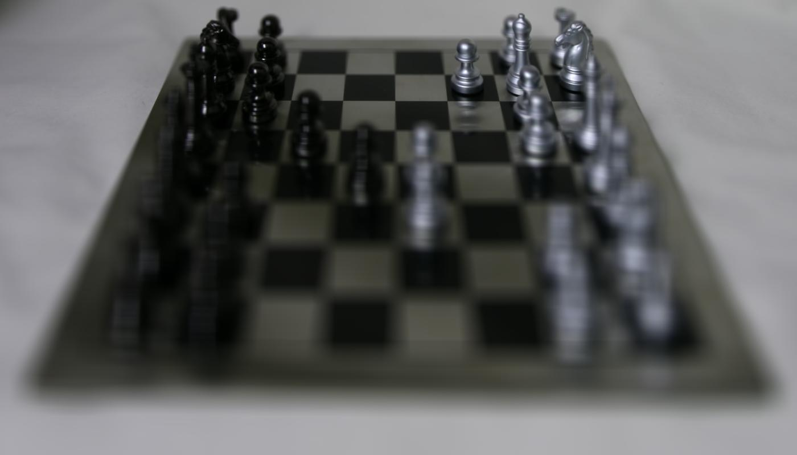 | 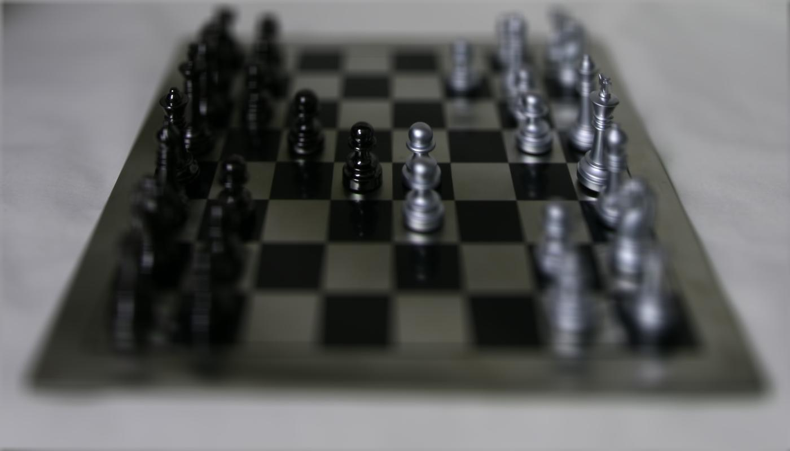 |  | 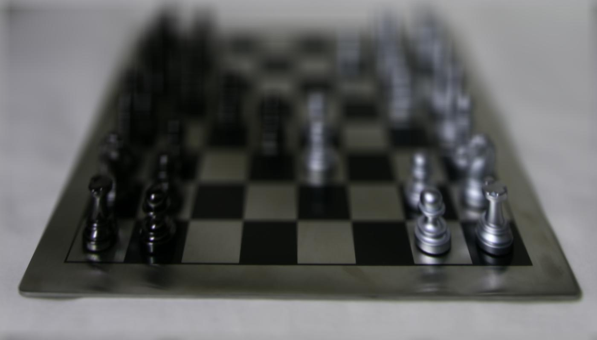 |

Here is the GIF over `depth_factor=0` to `depth_factor=3`. As the depth factor value increases, the focus shifts from the back right of the chessboard to the front/bottom left.

  

## Aperture Adjustment

To change the aperture, I was largely able to copy the function from the previous part. The main difference is that I added an `aperture` parameter. For each image, if `if (abs(i - center[0]) > aperture` or `abs(j - center[1]) > aperture)`, then I skipped this image when calculating the average chessboard image. The following results are all from keeping `depth_factor=1.5` constant, with varying `aperture` values.

| `aperture=1` | `aperture=3` | `aperture=5` | `aperture=7` |
| :----: | :----: | :----: | :----: |
|  | 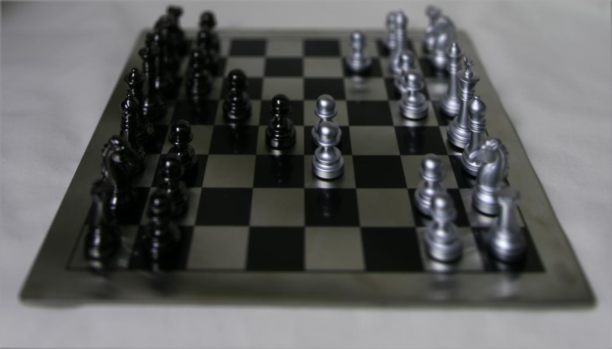 | 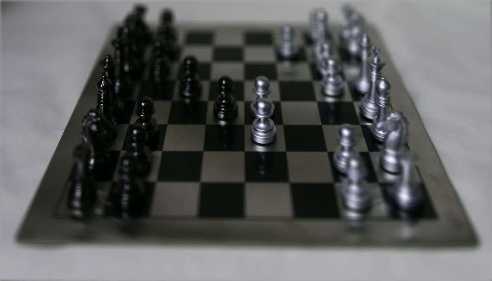 | 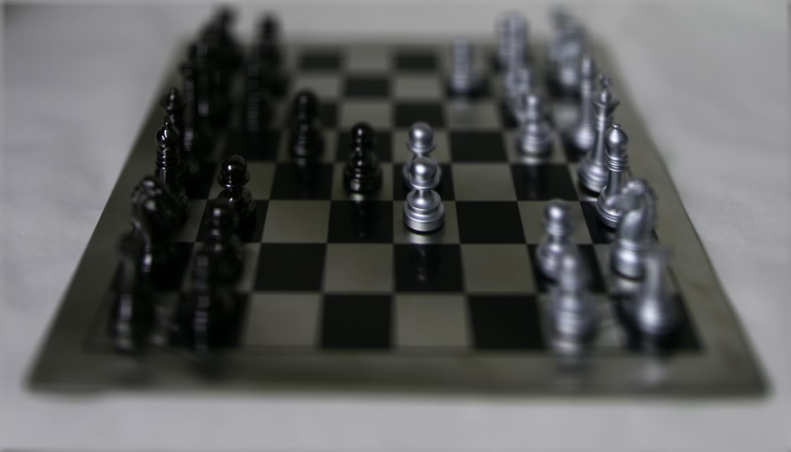 |

Here is the GIF over the `aperture=1` to `aperture=7`. As the aperture size value increases, the image becomes increasingly blurry around the edges.

  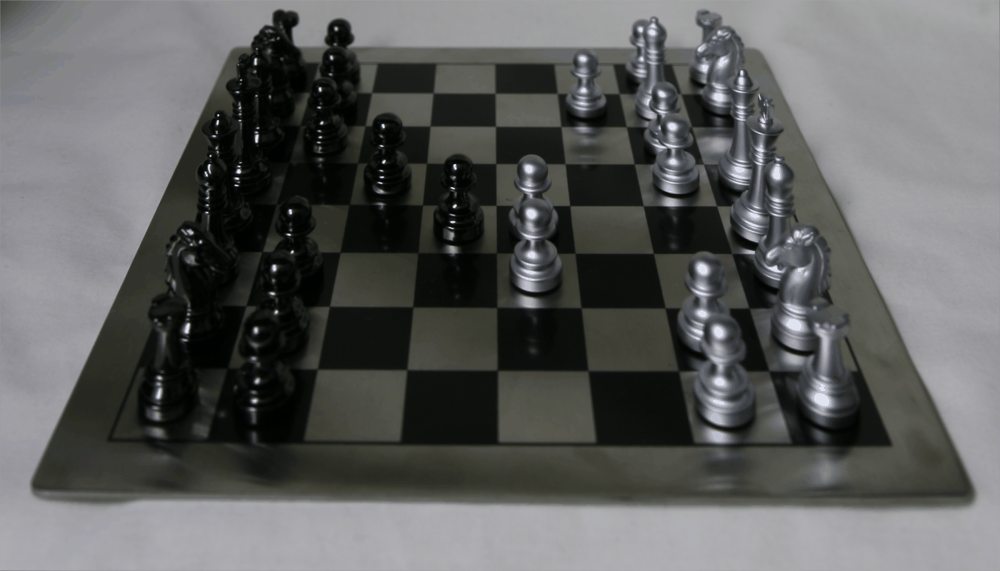

## Summary

It was interesting to see how the depth factor and aperture both affected the average chessboard image differently, and how they were able to change the final output when used simultaneously.

# Final Project - Gradient Domain Fusion

## Toy Problem
The goal of the toy problem is to optimize the following problem with an additional objective of minimizing $$ (v(1, 1) - s(1, 1))^2 $$.

$$
\min_v \sum_{x,y} (v(x+1, y) - v(x, y) - s(x+1, y) + s(x, y))^2 + (v(x, y+1) - v(x, y) - s(x, y+1) + s(x, y))^2
$$

This means that the x- and y-gradients of our new image must match the x- and y-gradients of our input image. The intensity of images for the source image is `s(x, y)`, and the values to solve for is `v(x, y)`. We can solve this least squares optimization problem as `Ax=b`, where `A` is a sparse matrix. `x` contains the pixel values for the new image.

The procedure for solving the toy problem is as follows. The total number of constraints is `h*(w-1) + (h-1)*w + 1`, where `h` is the number of rows/height of the image, and `w` is the number of columns/width of the image. The three terms are from the x-gradient objective, y-gradient objective, and the initial condition's objective respectively. I then intialize a sparse matrix `A`, least squares vector `b`, and counter variable `eq` to track the number of constraints. I iterate through the pixels through `h` and `c-1` for the x-gradient objective and increment `eq` for the next constraint. I repeat the method for the y-gradient objectives for `h-1` and `c`. We can solve the equations using `scipy.sparse.linalg.lsqr(A, b)` and reshaping the result to the input image's size.

Here are the results for the toy problem.

| Input Image | Output Image |
| :----: | :----: |
|  | 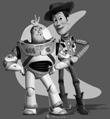 |

## Poisson Blending

First, here are what the output images look like if we naively paste the source image into the target image using the mask. There is clearly no blending, and the lines from the source image are very harshly visible.

| Source Image | Target Image | Mask | Naive Pasting |
| :----: | :----: | :----: | :----: |
|  |  | 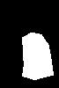 | 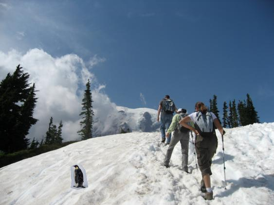 |
| 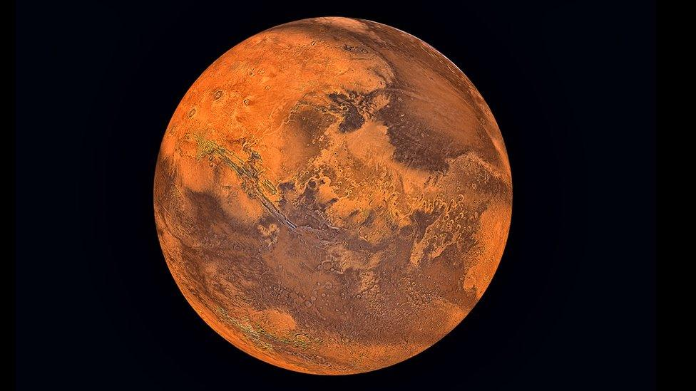 | 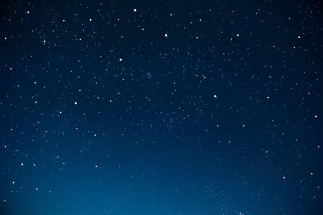 | 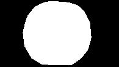 | 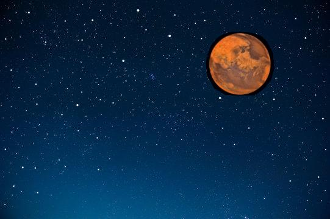 |
| 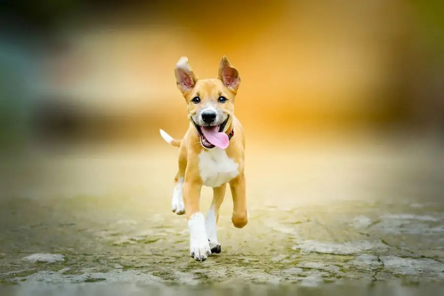 | 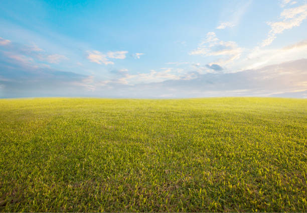 | 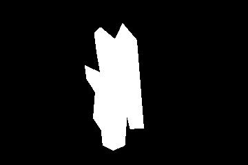 | 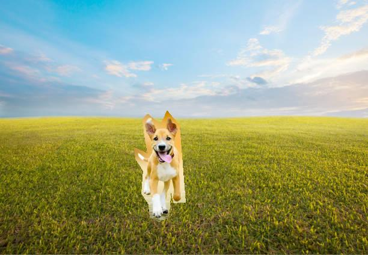 |

Here is how Poisson blending was implemented to resolve this issue. The goal is to solve this new optimization equation:

$$
\min_v \sum_{i \in S, j \in N_i \cap S} (v_i - v_j - s_i + s_j)^2 + \sum_{i \in S, j \in N_i \cap \bar{S}} (v_i - t_j - s_i + s_j)^2
$$

I first initialized my sparse matrix `A` to have size `num_pixels x num_pixels` since this was more effective than appending to A each time there was a new constraint. `b` started off as a list of zeros of length `num_pixels`. I iterated through all pixels in my source image and checked if the mask was true (within the blending region). If so, then I iterated through the 4 neighboring pixels. If the neighbor was a valid pixel in the source image and was in the mask/within the blending region, then I set the corresponding element in `A` to `-1`. If the neighbor valid but not in the blending region, then I add its value from the target image to `b`. After going through the neighbors, I add the source pixel's value and scale it by the number of valid neighbors we found (i.e. within bounds) to `b`. Then, I subtract the source pixel values of all the valid neighbors from `b`. If the pixel is outside the blending region, then we constrain it to the target image's pixel value and add that to `A`. We correspondingly at the difference between the target and source values to `b`. Finally, we can solve `Ax = b` similarly to the toy problem and reshape the solution into the source image. Then, we iterate over a copy of the target image and replace the pixels in the blending region with our least squares solution. Here are the results of the 3 images above but with this blending method.

| Penguin and Hike | Mars and Sky | Dog and Field |
| :----: | :----: | :----: |
| 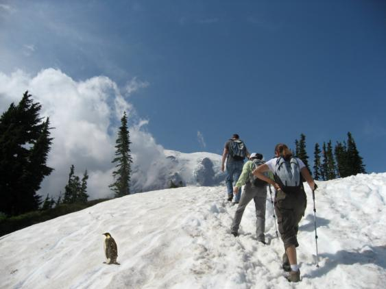 | 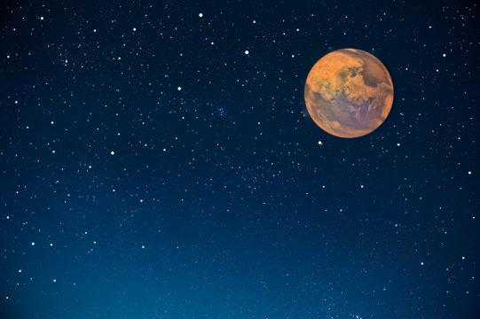 | 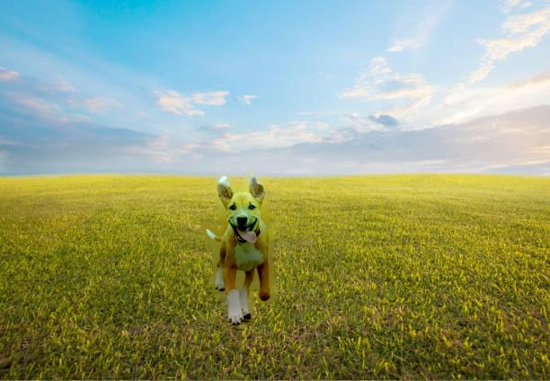 |

The images are blended a lot better. We can no longer see a direct line where the mask ends; instead, the images look pretty well integrated into the background.

## Bells and Whistles - Mixed Gradients

In the previous part, we only used the gradients in the source image as the reference. Now, we pick whichever gradient is larger in the source or target image. This can be done by just adding a condition when iterating through the neighbors. The source gradient is calculated as the different between the current pixel and the neighbor in the source image. The target gradient is calculated as the different between the current pixel and the neighbor in the target image. The rest of the algorithm is the same as before.

| Penguin and Hike | Mars and Sky | Dog and Field |
| :----: | :----: | :----: |
|  |  | 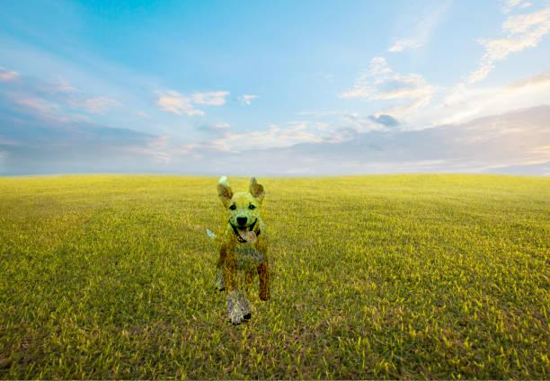 |

It is interesting to see where the larger gradients are selected. For the Mars image, we can see the tiny stars from the night sky that are on or right next to Mars (within the mask) are now showing up because they have a larger gradient (despite being in the target image). The same is the case for the dog image, since the gradients of the grass are occasionally larger than the dog. This makes the dog look a bit see through, so it may not always be optimal to choose mixed gradients!

## Summary

It was interesting to see a case where the mixed gradients method performed more poorly due to the texture of the target image. I enjoyed seeing how the concepts from the toy problem were able to play into solving a more complicated optimization.